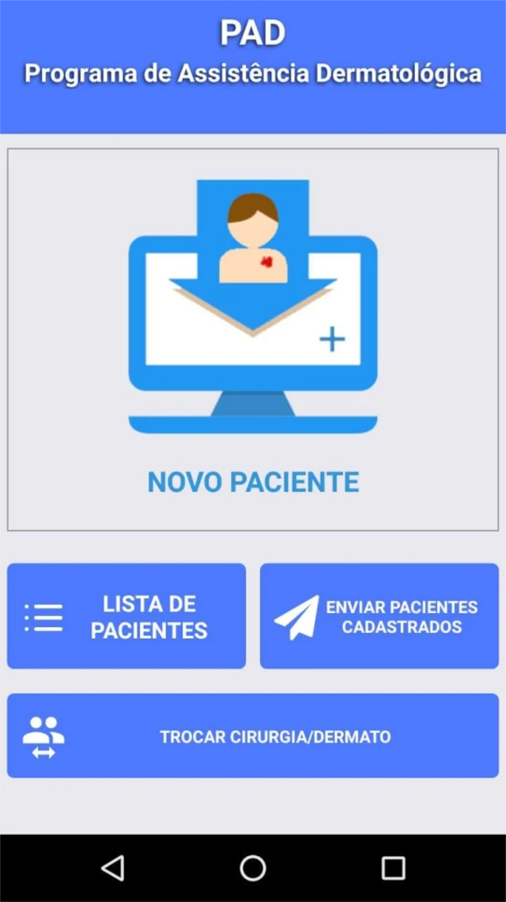
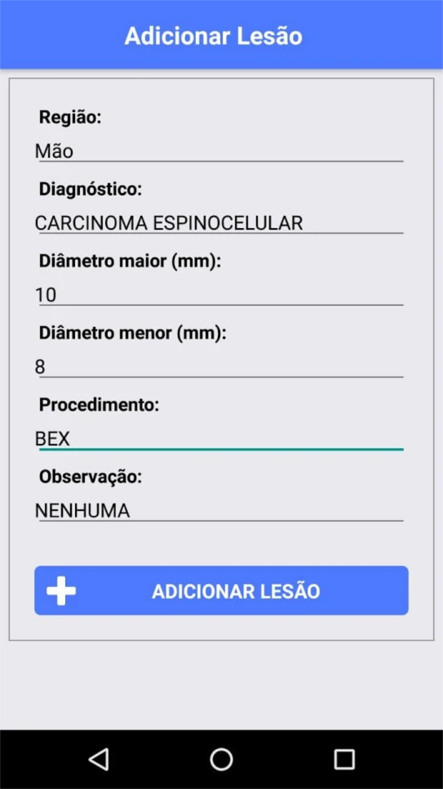
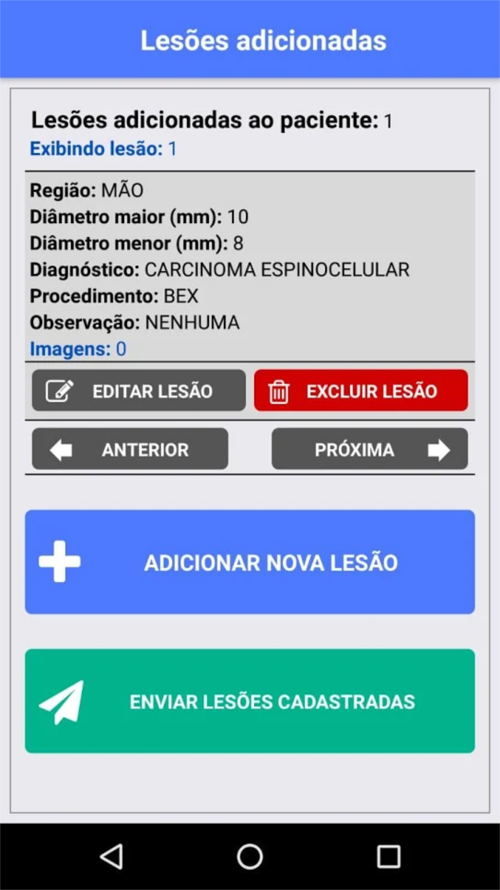

____
**Update:** we've had some papers published about this project. Thus, you can find the full description on:

+ The impact of patient clinical information on automated skin cancer detection. [Download](https://www.sciencedirect.com/science/article/pii/S0010482519304019)
+ Recent advances in deep learning applied to skin cancer detection. [Download](https://ml-retrospectives.github.io/neurips2019/assets/pdfs/Recent_advances_in_deep_learning_applied_to_skin_cancer_detection.pdf)
____

Here I describe the skin cancer project that I'm leading in my Lab. The main goal of my Ph.D. is to provide algorithms to deal with this problem. I'm going to describe what we've developed and what we are doing right now. But first, you may want to know how this story has started. So, it's described <a href="melanoma_detection" target="_blank" rel="noopener">here</a>.
<h3>Motivation</h3>
Skin cancer is the most common dysplasia around the world. Currently, around 3 million skin cancers occur globally each year [1]. In Brazil, it is one of the most serious public health issues. According to the Brazilian Cancer Institute [2], skin cancer accounts for 33% of all cancer diagnoses in the country. This is the highest diagnosis rate among all kind of cancer. Further, over the past decade, the skin cancer incidence increased 55% and for 2018-2019 it is expected 180 thousand new cases in the whole country. Nowadays, every hour a person dies in Brazil due to a skin cancer disease [2].

In order to diagnosis the skin cancer, dermatologists screen the skin lesion using their experience to diagnosis it. However, there are different types of skin cancer, and some of them are very hard to diagnose even for a trained dermatologist. To increase their diagnosis reliability, they use the dermatoscope, a medical instrument that allows the visualization of the subsurface structures of the skin revealing lesion details in colors and textures. In addition, they also take into accounting more information about the patient such as  time of sun exposure, family ancestry, if the lesion bleeds or hurts, if it itches, among others. **As Brazil is an economically emerging country, most of its countryside cities do not have dermatologists nor dermatoscopes available for general practitioners**. Certainly, this issue delays and decreases the clinical diagnosis reliability. Thereby, an approach to automatically detect skin cancer that does not depend on dermoscopy images is very desired, mainly for general practitioners and medical students. According to Ericsson mobility report [3], there are now more than four billion smartphones around the world. In Brazil, more than 130 millions of people, around 77% of the population, have their own smartphone [4]. Therefore, a computer-aided diagnosis (CAD) system embedded in smartphones seems to be a low-cost approach that may assist doctors and medical students to provide a more reliable skin cancer diagnosis mainly in emerging countries like Brazil.

<h3>Objective</h3>
The main goal of this project is to develop new methodologies to skin cancer detection using images collected from smartphones and patient demographics. We focus on proposing a deep learning technique that is able to combine both images and clinical information. Moreover, we also aim to develop a web platform to open the collected dataset for research purposes. As far as we know, there is no public skin cancer dataset composed of clinical images and patient demographics. We want to fulfill this gap. 

<h3>Work description</h3>
There are great works proposing skin cancer detection for dermoscopy images [5,6]. A public dataset of dermoscopy images is provided by ISIC. However, as stated before, most cities in Brazil don’t have dermatoscope available. Therefore, we need to handle this issue, and the first step is to obtain a dataset, since there’s no public dataset of skin cancer images collected from standard cameras. So, how can we obtain such a dataset?

In late 2017, we started a partnership with the Dermatological Assistance Program (PAD) of the Federal University of Espírito Santo. This program, which was founded in 1989, provides medical assistance to low-income people who can’t afford a private skin cancer treatment. Normally, once per month a group of dermatologists, plastic surgeon, and medical students go to the countryside cities to provide the medical care, which takes place over the whole weekend. On average, 300 people are assisted by the doctors and students. First, the doctors promote the prevention phase. They talk with the population in order to teach them good practices to reduce the probability of getting skin cancer. Next, the patient demographics are collected by the students. In the following, this patient is led to the dermatologists, which screen the lesion and provide the diagnosis. These dermatologists are extensively trained and are able to provide the diagnostic with high confidence. Finally, if the patient’s lesion is at an advanced level, he/she is led to the plastic surgeon to proceed with a surgical process. In this case, this lesion needs to be removed and sent to the biopsy process. On the other hand, if the lesion isn’t that bad, the patient is led to a treatment less invasive, for example, using some specific medicine on the skin. <strong>Therefore, since 1989, thousands of lives were saved through this program, which provides a full treatment, from the screening to the surgical process.</strong>

Recently, a Brazilian TV news broadcast produced an amazing documentary about PAD. Obviously, it is in Portuguese, but you can activate the translate in YouTube if you can’t understand the language.

<iframe src="https://www.youtube.com/embed/5nwDBwNCrR0" width="615" height="415" frameborder="0" allowfullscreen="allowfullscreen"></iframe>

&nbsp;

By means of our partnership, we developed a system to collect and store the patient demographics as well as the skin lesion images taken using smartphones. Our system is composed of two main parts. The first one is the server. It was built using SpringBoot for the back-end and Angular for the front-end. Below you can see some screenshots of the system (you also [can access this system](http://labcin.ufes.br/sade), however, as it contains private data, only allowed people can use that).



In order to send information to the web system, we developed a smartphone application for both Android and iPhone platforms using React-Native. Through this app, the doctors and students take the photos of the skin lesion, fulfill some questions about the patient, and send everything to the web server. Below, you can see some pics of our app. Actually, you can [download it](https://play.google.com/store/apps/details?id=ufes.pad.app&hl=pt_BR) if you want, but it works only on a local network.

<!-- 
<figure class="third ">
      

	  

	  
    <figcaption>This is a sample gallery with <strong>Markdown support</strong>. </figcaption>
</figure>
-->



Below, you can also check some sample of images from our dataset. As you can note, they are quite different from the <a href="https://challenge2018.isic-archive.com/" target="_blank" rel="noopener">dermatoscopy ones.</a>



From the images above, we can note that developing an automated approach to detect skin cancer is a very challenging task. We have to deal with plenty of problems, among them:
<ul>
 	<li>The smartphone images present high variability caused by lighting, zoom, camera model, ink markings, etc.</li>
 	<li>The number of images available for this task is limited. The data collection is going on.</li>
 	<li>The number of samples for each type of skin cancer is very imbalanced</li>
</ul>
In order to tackle these challenges, we complement the image data with 28 different patient clinical features, such as age, the lesion region, and size, the patient daily habits, family ancestry etc. Therefore, each skin lesion in our dataset has an image and its related clinical data. That is what the dermatologists do, they do not trust only on the screening, they also use the patient clinical information to provide a more reliable diagnostic. In this sense, we believe we cannot waste this clinical information, but include it into the recent developments to improve even more the diagnosis.

<h3>References</h3>
[1]  WHO. How common is the skin cancer? 2018. World Health Organization (WHO). Available on http://www.who.int/uv/faq/skincancer/en/index1.html.

[2]  National Institute of Cancer José Alencar Gomes (INCA). “The cancer incidence in Brazil”. (2018, May 4). Retrieved from <a href="http://www.inca.gov.br/estimativa/2018">http://www.inca.gov.br/estimativa/2018</a>.

[3]  Ericsson. Ericsson mobility report. Stockholm, Sweden, 2017. Available on https://www.ericsson.com/assets/local/mobility-report/documents/2017/ericsson- mobility-report-june-2017.pdf.

[4] IBGE. Internet and television access and smartphone possession for personal use. 2016. Brazilian Institute of Geography and Statistics Foundation. Available on https://biblioteca.ibge.gov.br/visualizacao/livros/liv101543.pdf.

[5] Yu, Lequan, et al. "Automated melanoma recognition in dermoscopy images via very deep residual networks." IEEE transactions on medical imaging 36 (4), p. 994-1004, 2017.

[6]  Valle, Eduardo, et al. "Data, Depth, and Design: Learning Reliable Models for Melanoma Screening." arXiv preprint arXiv:1711.00441, 2017.